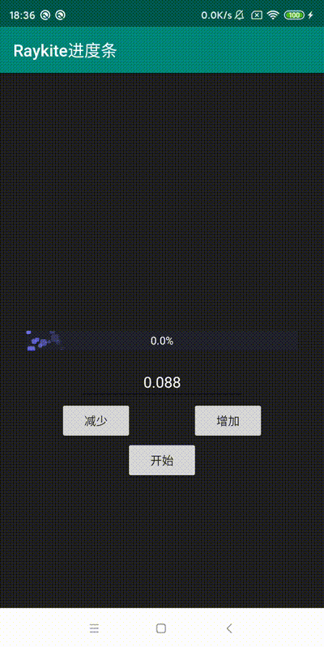
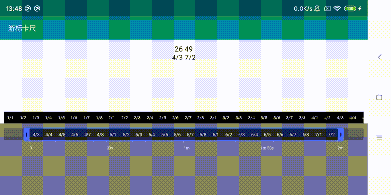
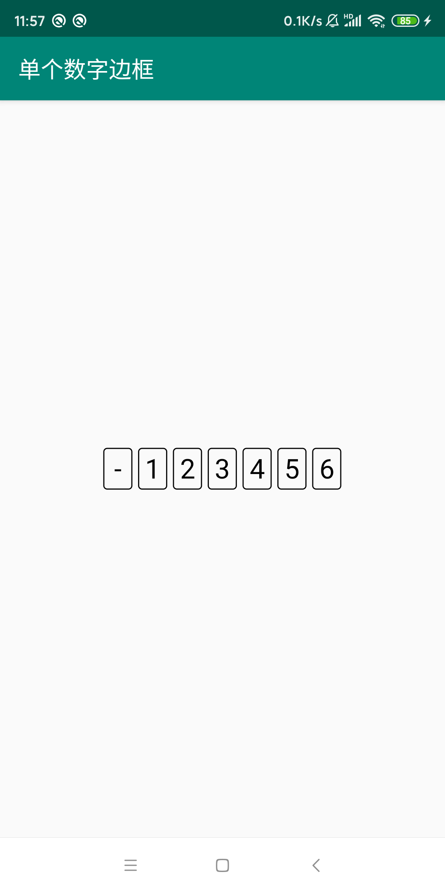
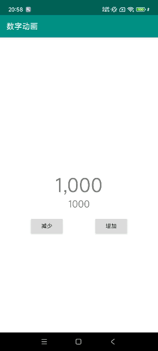
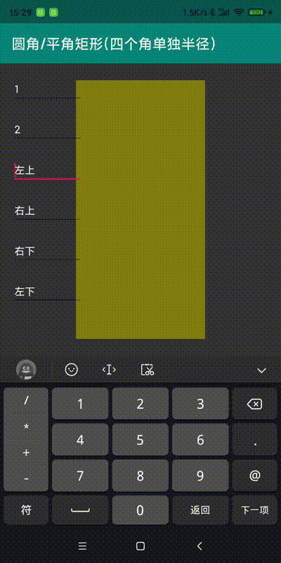
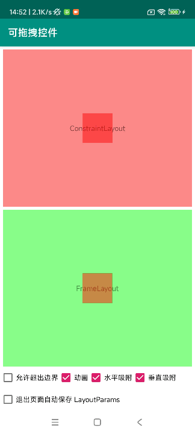
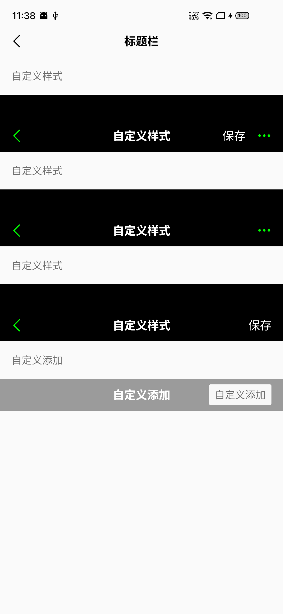

Android自定义控件，不定时增加。  
因 Gif 原因，实际效果以真机运行为准。

**View 相关**

1. 折线图；
2. 曲线图；
3. 密码输入框；
4. 带清空按钮的输入框；
5. 信用分仪表盘；
6. 水波纹扩散动画；
7. 指示器；
8. 粒子动画进度条；
9. 游标卡尺；
10. 单个数字边框；
11. 数字动画
12. 颜色拾取器；
13. 渐变旋转；
14. 圆角/平角矩形(四个角单独半径)；
15. 汉字拼音首字母索引栏(仿微信通讯录)；
16. 可拖拽控件(支持吸附、动画等配置)；
17. 标题栏(支持右侧文本、图标、添加View)；

**其他**

1. Fragment 对用户可见回调基类；

**1. 折线图**  
随时间而变化的连续数据  

**2. 曲线图**  
随时间而变化的连续数据  

**3. 密码输入框**  
密码不可见为黑点的输入框  

**4. 带清空按钮的输入框**  
输入框前面有小图标，后面当有内容输入时会有清空按钮  

**5. 信用分仪表盘**  

**6. 水波纹扩散动画**  

**7. 指示器**  
可用于ViewPager指示器  

**8. 粒子动画进度条**    

**9. 游标卡尺**    

**10. 单个数字边框**    

**11. 数字动画**    

**12. 颜色拾取器**    

**13. 渐变旋转**    

**14. 圆角/平角矩形(四个角单独半径)**    

**15. 汉字拼音首字母索引栏(仿微信通讯录)**    

**16. 可拖拽控件(支持吸附、动画等配置)**    

**17. 标题栏(支持右侧文本、图标、添加View)**    
  