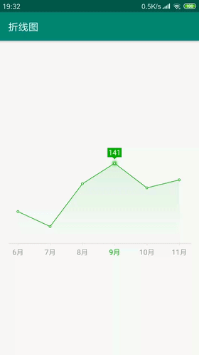
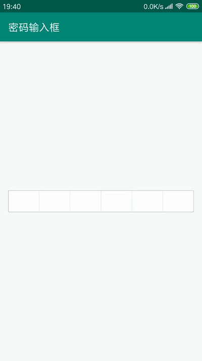
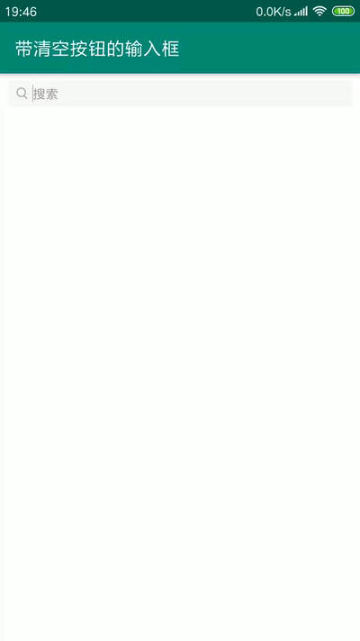
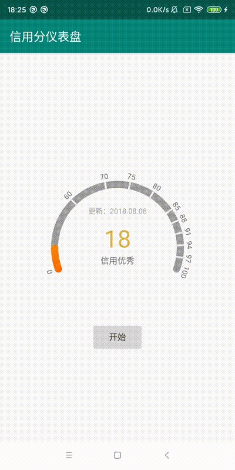
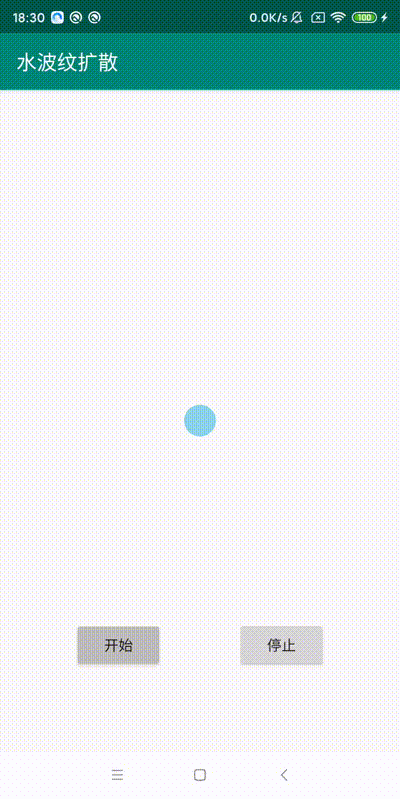
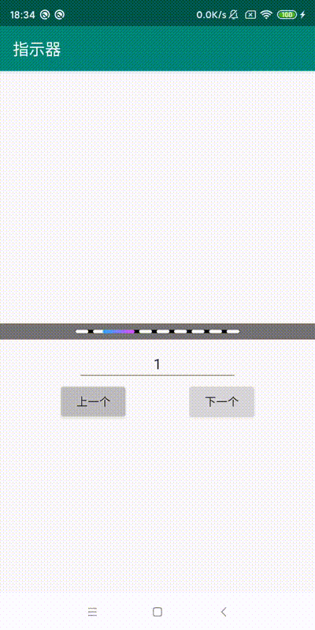
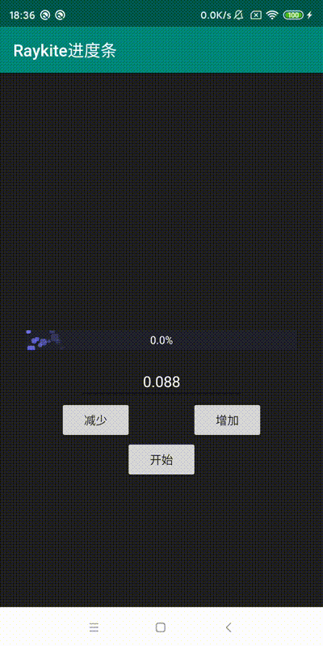

Android自定义控件，不定时增加。  
因Gif原因，实际效果以真机运行为准。

1. 折线图；
2. 密码输入框；
3. 带清空按钮的输入框；
4. 信用分仪表盘；
5. 水波纹扩散动画；
6. 指示器；
7. 进度条。

**1. 折线图**  
    随时间而变化的连续数据  
      
    
**2. 密码输入框**  
    密码不可见为黑点的输入框  
      
    
**3. 带清空按钮的输入框**  
    输入框前面有小图标，后面当与内容输入时会有清空按钮  
      
    
**4. 信用分仪表盘**  
      
    
**5. 水波纹扩散动画**  
      
    
**6. 指示器**  
    可用于ViewPager指示器  
      
    
**7. 进度条**    
      
