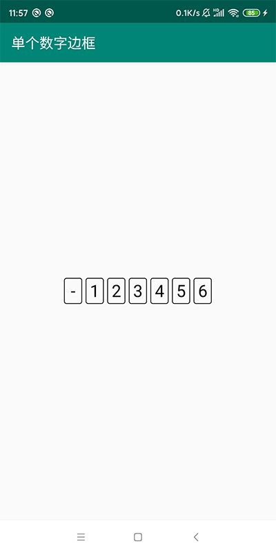

Android自定义控件，不定时增加。  
因Gif原因，实际效果以真机运行为准。

1. 折线图；
2. 密码输入框；
3. 带清空按钮的输入框；
4. 信用分仪表盘；
5. 水波纹扩散动画；
6. 指示器；
7. 粒子动画进度条；
8. 游标卡尺；
9. 单个数字边框；
10. 颜色拾取器；
11. 渐变旋转；
12. 圆角/平角矩形(四个角单独半径)；
13. 汉字拼音首字母索引栏(仿微信通讯录)；
14. 可拖拽控件(支持吸附、动画等配置)；
15. 标题栏(支持右侧文本、图标、添加View)；

**1. 折线图**  
随时间而变化的连续数据  

**2. 密码输入框**  
密码不可见为黑点的输入框  

**3. 带清空按钮的输入框**  
输入框前面有小图标，后面当有内容输入时会有清空按钮  

**4. 信用分仪表盘**  

**5. 水波纹扩散动画**  

**6. 指示器**  
可用于ViewPager指示器  

**7. 粒子动画进度条**    

**8. 游标卡尺**    

**9. 单个数字边框**    

**10. 颜色拾取器**    

**11. 渐变旋转**    

**12. 圆角/平角矩形(四个角单独半径)**    

**13. 汉字拼音首字母索引栏(仿微信通讯录)**    

**14. 可拖拽控件(支持吸附、动画等配置)**    
  

**15. 标题栏(支持右侧文本、图标、添加View)**    
  